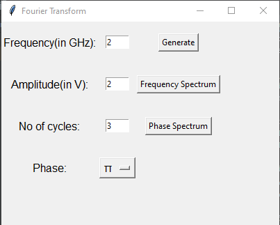
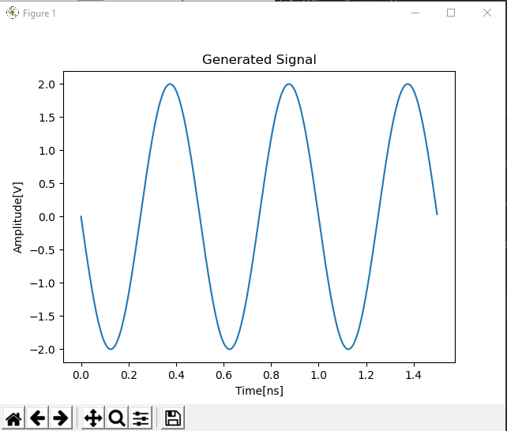
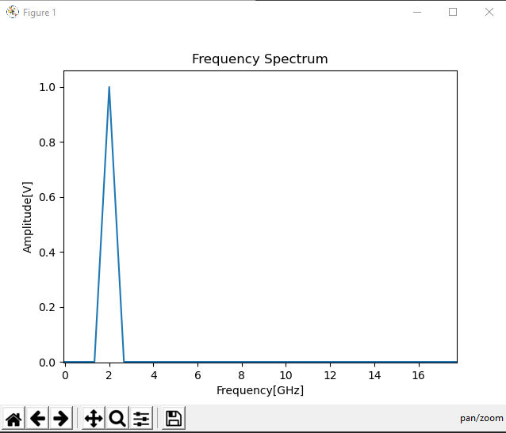
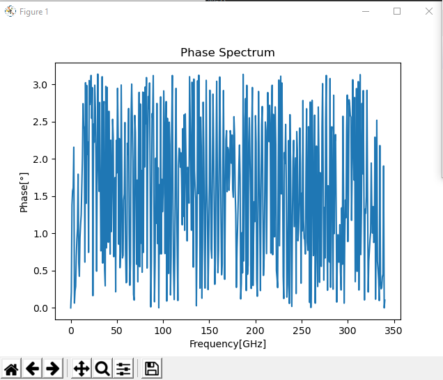

# Fourier Transform
Python implementation for fourier transformation for sine signal
Explanation on how fourier transform works

## Requirements
* Tested on Python 2.7 and Python 3.6
*        pip install -r requirements.txt

## Usage 
    python main.py
## Sample

           
## Resources
* Fourier transform documentation: https://mathworld.wolfram.com/FourierTransform.html
* Tkinter Link: https://tutorialspoint.com/python/python_gui_programming.htm           
           
